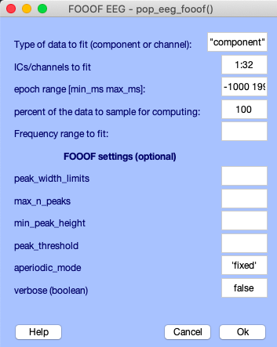
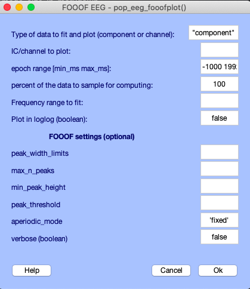
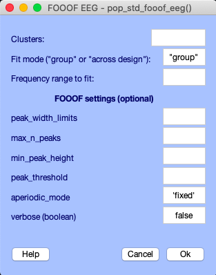
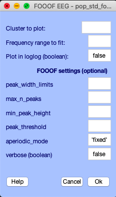
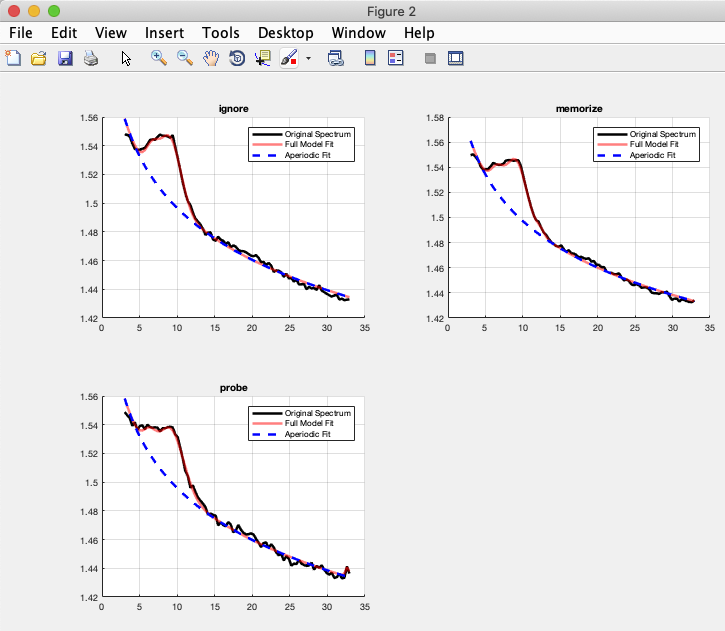

# FOOOF for EEGLAB

FOOOF is a fast, efficient, and physiologically-informed tool to parameterize neural power spectra. To learn more about it, please visit the [official FOOOF repository](https://github.com/fooof-tools/fooof).

This EEGLAB plugin uses FOOOF's matlab wrapper, [fooof_mat](http://github.com/fooof-tools/fooof_mat).

## Dependencies
Provided FOOOF's Python dependencies are satisfied (numpy and scipy >= 0.19), install FOOOF with pip:
    
    $ pip install fooof
or conda:

    $ conda install -c conda-forge fooof


make sure Matlab's version of Python (verified with `>>pyversion`) is >= 3.0
- Switch versions with `>> pyversion 3.X` or `>> pyversion ~/location_of_python`

## Quickstart

To add this plugin to EEGLAB, clone this repository into `~/MATLAB/eeglab_version/plugins`

    $ git clone https://github.com/bfbarry/EEGLAB-FOOOF.git

### **FOOOF on a dataset**
For EEG data, load a dataset (for a test set, load: `~/MATLAB/eeglab_version/sample_data/eeglab_data_epochs_ica.set`)

To fit power spectra, select *Tools > FOOOF > Fit power spectra*. This calls `pop_eeg_fooof()`. The following menu will appear:<br>



- `ICs/channels to fit` can be a colon vector, array, or single value.
- `epoch range` and `percent of data to sample for computing` are default `pop_spectopo()` arguments
- `Frequency range to fit` will be asked by default on every UI item in this plugin and determines both spectral computation and fitting range.
- The FOOOF settings are optional and used for the algorithm. For a thorough explanation of these, please see the [wiki](https://fooof-tools.github.io/fooof/#).
    - `peak_width_limits` sets the possible lower- and upper-bounds for the fitted peak widths.
    - `max_n_peaks` sets the maximum number of peaks to fit.
    - `min_peak_height` sets an absolute limit on the minimum height (above aperiodic) for any extracted peak.
    - `peak_threshold` sets a relative threshold above which a peak height must cross to be included in the model.
    - `aperiodic_mode` defines the approach to use to parameterize the aperiodic component.

`Fit power spectra` will add a struct to EEG.etc called FOOOF_results. Here is what indexing the first component of this struct approximately looks like:

```MATLAB
>> EEG.etc.FOOOF_results{1}

ans = 

  struct with fields:

    aperiodic_params: [1.5325 1.4917]
         peak_params: [3×3 double]
     gaussian_params: [3×3 double]
               error: 0.0309
           r_squared: 0.9982
               freqs: [1...n]
      power_spectrum: [1×33 double]
    fooofed_spectrum: [1×33 double]
              ap_fit: [1×33 double]
```

To plot a component's fit, select *Tools > FOOOF > Plot fit*. This calls `pop_eeg_fooofplot()`. The following menu will appear:<br>



This has the same arguments as before, but will only accept one IC or channel to plot. You may also plot it on log-log axes.<br>
<br>
### **FOOOF on a STUDY**
For STUDY data, load a study (for a test study, download the [STERN study](http://sccn.ucsd.edu/eeglab/download/STUDYstern_125hz.zip), and once loaded go to *STUDY > Precompute component measures >* and select  *power spectrum* to extract necessary files.)

To fit power spectra, select *STUDY > FOOOF > Fit power spectra*. This calls `pop_std_fooof()`. The following menu will appear:<br>



- `Clusters`, like component from the Tools UI, can be a colon vector, array, or single value.
- `Fit mode` is the dimension along which you would like to fit your spectra. "group" will fit every component within the design, while "across design" will only fit the averaged designs. For n designs, "group" will save a n × 1 struct in the FOOOF results for the desired cluster, while "across design" will save a a 1 × n struct.

As mentioned, `Fit power spectra` will add a struct to STUDY.etc called FOOOF_results, with the following contents (the shape of which depends on the design). For example:
```MATLAB
>> STUDY.etc.FOOOF_results{i}

ans = 

1×3 struct array with fields:

    aperiodic_params
    peak_params
    gaussian_params
    error
    r_squared
    freqs
    power_spectrum
    fooofed_spectrum
    ap_fit
```

To plot a fit, select *STUDY > FOOOF > Plot cluster fit*. This calls `pop_std_fooofplot()`. This will plot the fit for each design variable (averaged over components). The following menu will appear:<br>



- `Cluster`: This accepts a single cluster ID.<br>
- `Plot in loglog`: is a boolean.

The plot uses fooof_mat's plotting functionality:




# Reference
If you use this code in your project, please cite:

    Donoghue T, Haller M, Peterson EJ, Varma P, Sebastian P, Gao R, Noto T, Lara AH, Wallis JD,
    Knight RT, Shestyuk A, & Voytek B (2020). Parameterizing neural power spectra into periodic
    and aperiodic components. Nature Neuroscience, 23, 1655-1665.
    DOI: 10.1038/s41593-020-00744-x

### Relevant repos (development)
- https://github.com/fooof-tools/fooof
- https://github.com/fooof-tools/fooof_mat
- https://github.com/sccn/eeglab/blob/develop/functions/popfunc
- https://github.com/sccn/eeglab/blob/develop/functions/studyfunc