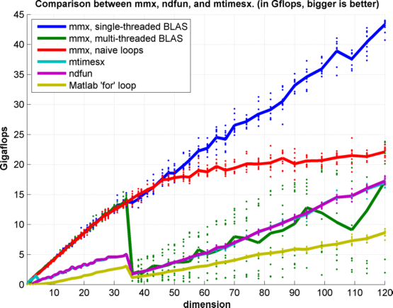

# mmx

### Multithreaded matrix operations on N-D arrays (a Matlab plug-in)

**mmx** treats an N-D matrix of double precision values as a set of pages of 2D matrices, and performs various matrix operations on those pages.

**mmx** uses multithreading over the higher dimensions (coarse-grained multithreading) to achieve good performance. Full singleton expansion is available for most operations.

#### Matrix multiplication:

```matlab
C = mmx('mult', A, B)
```
is equivalent to 

```matlab
for i=1:N, 
  C(:,:,i) = A(:,:,i) * B(:,:,i); 
end
``` 
Singleton expansion is enabled on all dimensions so for example if 

```matlab
A = randn(5,4,3,10,1); 
B = randn(4,6,3,1 ,6); 
C = randn(5,6,3,10,6); 
```
then 

```matlab
C = mmx('mult', A, B)
```
is equivalent to 

```matlab
for i = 1:3 
  for j = 1:10 
    for k = 1:6 
      C(:,:,i,j,k) = A(:,:,i,j,1) * B(:,:,i,1,k); 
    end 
  end 
end
```
#### Transposition:
```matlab
C = mmx('mult', A, B, mod)
```
where mod is a modifier string, will 
transpose one or both of A and B. Possible values for mod are 
`'tn'`, `'nt'` and `'tt'` where 't' stands for 'transposed' and 'n' for 
'not-transposed'. For example 

```matlab
>> size(mmx('mult',randn(4,2),randn(4,2),'tn')) 
ans = 2 2
```
#### Squaring:
```matlab
C = mmx('square', A, [])     % C = A*A' 
C = mmx('square', A, [],'t') % C = A'*A
C = mmx('square', A, B)      % C = (A*B'+B*A') / 2
C = mmx('square', A, B, 't') % C = (A'*B+B'*A) / 2
```
#### Cholesky factorization:

```matlab
C = mmx('chol', A, []) % C = chol(A)
```

#### Solving linear equations:
```matlab
C = mmx('backslash', A, B) % C = A\B
```

Unlike other __mmx__ commands, `'backslash'` does not support singleton 
expansion. If A is square, __mmx__ will use LU factorization, otherwise it will use QR factorization. In the underdetermined case, (i.e. when 
`size(A,1) < size(A,2)`), __mmx__ will give the least-norm solution which 
is equivalent to `C = pinv(A)*B`, (unlike Matlab's `mldivide`).

`C = mmx('backslash', A, B, 'U')` or `mmx('backslash', A, B, 'L')` will 
perform `C = A\B` assuming that A is upper or lower triangular, 
respectively.

`C = mmx('backslash', A, B, 'P')` will perform `C = A\B` assuming that A 
is symmetric positive definite.

`mmx(n)` does thread control: __mmx__ will automatically start a number of threads equal to the number of available processors, however the 
number can be set manually to n using the command `mmx(n)`. `mmx(0)` clears the threads from memory.

__IMPORTANT NOTE:__ The functions which assume special types of square 
matrices as input ('chol' or 'backslash' for 'U','L' or 'P' 
modifiers) _do not check_ that the inputs are what you say they 
are, and _produce no error_ if they are not. Caveat computator.

### Compilation: 
Run `build_mmx`. Type `help build_mmx` to read about compilation issues and options.

### Performance:
